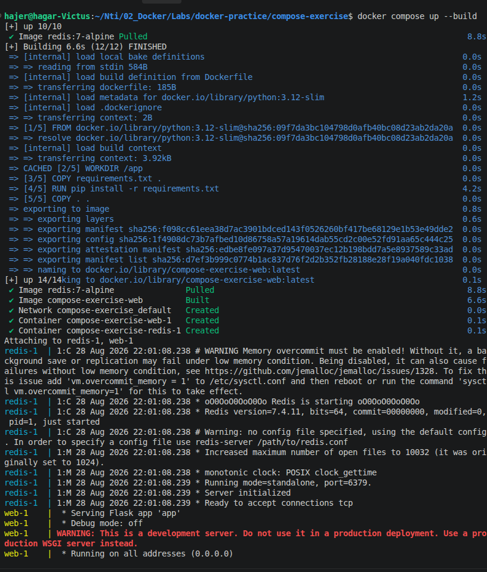
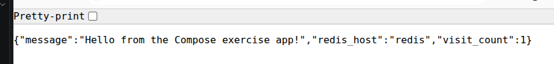
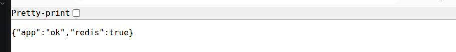
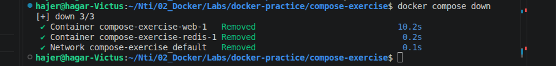
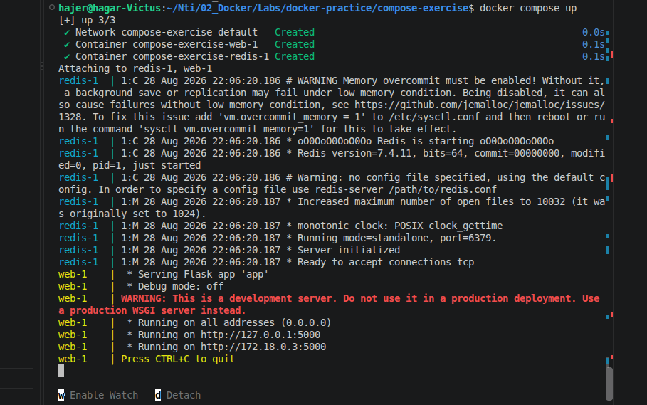

# Compose app

## build and run 

```
docker compose up --build
```












## Questions

### 1. How did `web` find `redis` on the network without you specifying an IP address?

* Docker Compose creates a default network for the services.
* Each service can be reached using its service name as a hostname.
* We set `REDIS_HOST=redis`, so the web container connects to the Redis container using `redis` instead of an IP address.

### 2. What is the difference between `docker compose down` and `docker compose down -v`?

* `docker compose down` removes the containers and network but keeps named volumes.
* `docker compose down -v` also removes the named volumes and their data.
* I used `docker compose down` without a volume, so the Redis container was removed and the counter reset when I started the application again.

### 3. What does `depends_on` guarantee by default?

* `depends_on` guarantees that the dependency is started before the dependent service.
* It does not guarantee that the dependency is ready to accept connections.
* I did not use `depends_on` with a healthcheck in this exercise.

### 4. If you wanted to run three copies of the `web` service behind a load balancer, what would you need to change about the port mapping?

* I would not map the same host port directly to all three containers.
* The three web containers can use the same internal port, but a load balancer should expose one host port and distribute requests between the three containers.

