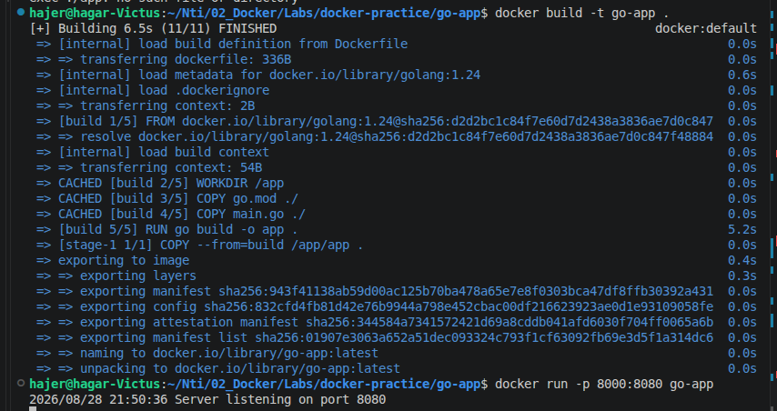
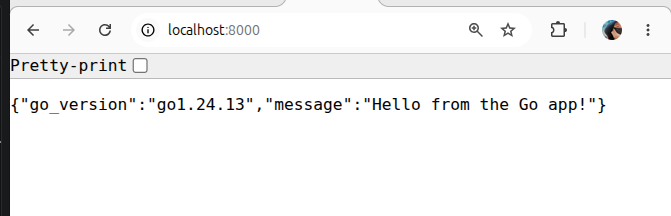
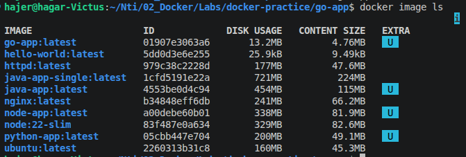
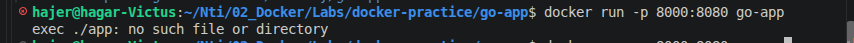

# Go app

## Build and run 
```
docker build -t go-app .
docker run -p 8000:8080 go-app
```




---
---

## Questions

### 1. What is `scratch`, and why can Go (but not Python or Node) realistically run on top of it?

* `scratch` is an empty base image with almost nothing inside it.
* Go can run on `scratch` because Go can compile the application into a standalone binary.
* Python and Node need their runtimes and dependencies to run the application, so they cannot normally run directly on `scratch`.

### 2. What is the final image size? Rank all four language exercises by image size and explain the pattern you see.

* Go image: 4.76 MB
* Python image: 49.1 MB
* Node.js image: 81.9 MB
* Java image: 115 MB

Ranking from smallest to largest:

1. Go — 4.76 MB
2. Python — 49.1 MB
3. Node.js — 81.9 MB
4. Java — 115 MB



The Go image is much smaller because the final image contains only the compiled Go binary and uses `scratch` as the base image.

Python, Node.js, and Java need their runtimes and other files to run the applications, so their final images are larger.

### 3. What does `CGO_ENABLED=0` do when building the Go binary, and why does it matter for a `scratch`-based image?

* `CGO_ENABLED=0` disables CGO when building the Go application.
* This helps produce a statically linked binary.
* The binary does not need external C libraries to run.
* This is important for a `scratch` image because `scratch` does not contain these libraries.



