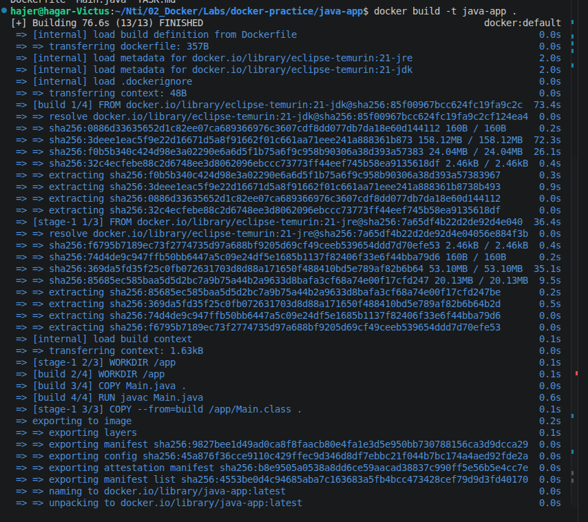
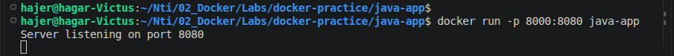
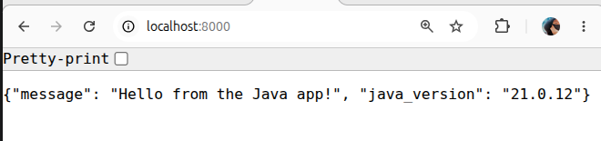
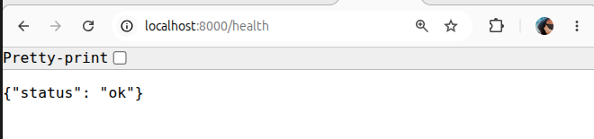
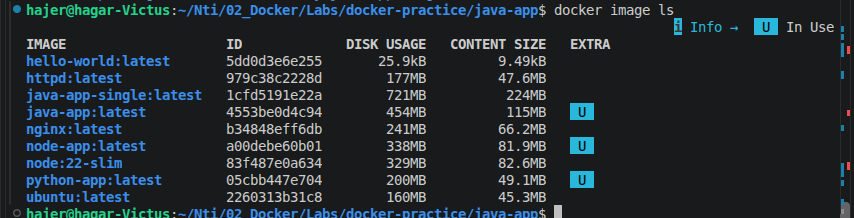

# Java app 

## Build and run 
 ```
docker build -t java-app .
docker run -p 8000:8080 java-app
```









## Questions

### 1. What is the difference between a JDK image and a JRE image? Which does your final runtime stage use?

* JDK contains the tools needed to develop and compile Java applications, including `javac`.
* JRE contains what is needed to run Java applications.
* The build stage uses the JDK because we need `javac` to compile the application.
* The final runtime stage uses the JRE because we only need to run the compiled application.

### 2. How much smaller is your multi-stage image compared to a naive single-stage build?


* Single-stage image: 224 MB
* Multi-stage image: 115 MB
* The multi-stage image is about 109 MB smaller.
* It is about 49% smaller than the single-stage image.
* The multi-stage image is smaller because the final image uses the JRE and only copies the compiled `.class` file from the build stage.



### 3. In a multi-stage build, what happens to the `build` stage after the final image is produced — is it kept anywhere?

* The build stage is not included in the final image.
* Only the files copied from the build stage are included in the final image.
* The final image contains only the runtime stage.

### 4. Why might you not want a compiler (`javac`) present in your production image at all?

* The compiler is not needed to run the application.
* It makes the image larger.
* It also adds unnecessary tools to the production environment.
* Keeping only the runtime environment makes the image smaller and more secure.
