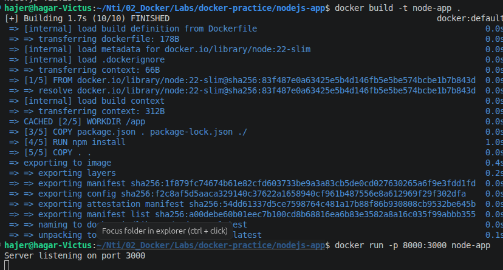
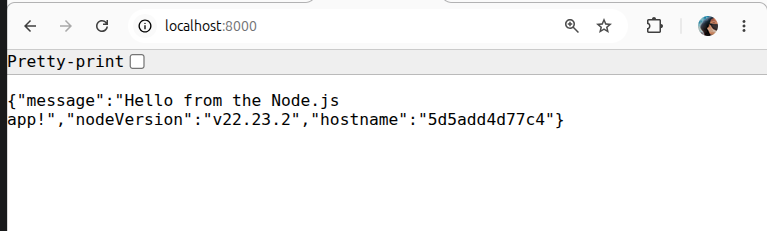
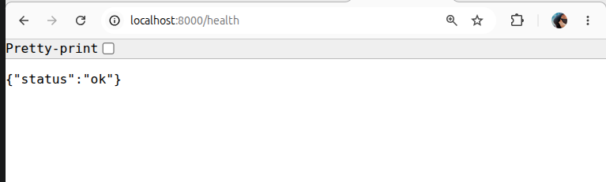
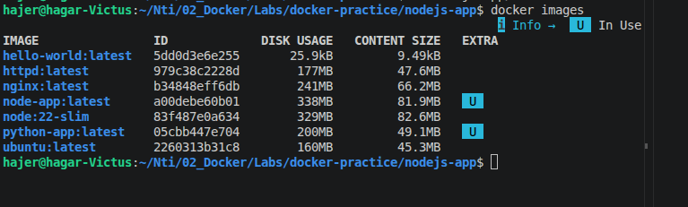

# Node app

## build and run 

```
docker build -t node-app .
docker run -p 8000:3000 node-app
```








## Questions

### 1. Why do we copy `package.json` before the rest of the source code?

* To use Docker cache and make the build faster.
* If the source code changes but `package.json` does not change, Docker can reuse the dependency installation layer instead of running `npm install` again.

### 2. What is a multi-stage build, and did you use one? What problem does it solve?

* A multi-stage build uses more than one `FROM` in the Dockerfile.
* We can use one stage to install or build the application and another stage for the final runtime image.
* It can make the final image smaller by copying only the files needed to run the application.
* `I did not use a multi-stage build here`.

### 3. Why is running a container as a non-root user considered a security best practice?

* Running as a non-root user improves security.
* If the application is compromised, the attacker will have fewer permissions inside the container.
* This reduces the possible damage.

### 4. Compare your final Node image size to the Python image size from Exercise 1. Are they comparable? Why or why not?



* Node image: 81.9 MB
* Python image: 49.1 MB
* The Node image is larger than the Python image.
* They are not directly comparable because they use different base images and different runtimes and dependencies.
* The image size also depends on the application and the packages installed.

