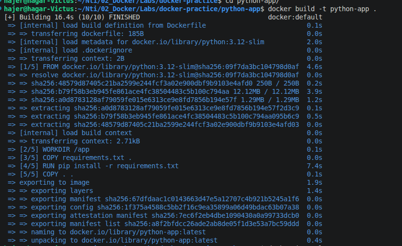
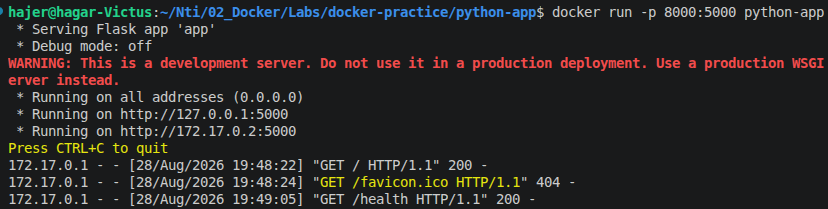
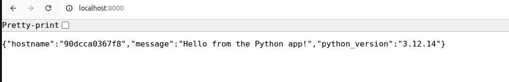
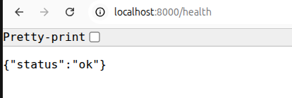

# Pyhton app

## Build 
```
docker build -t python-app .
```




## Run 
```
docker run -p 8000:5000 python-app
```







---
---

# Questions

### 1. What base image did you choose, and why?

* `python:3.12-slim`
* because it has the Python version and dependencies needed for the app and it is smaller than the full Python image.

---

### 2. What is the final image size, and what did you do (if anything) to reduce it?

* `49.1 MB` content size.
* I used `python:3.12-slim` instead of the full Python image.
* I copied `requirements.txt` in a separate layer before copying all the application files, so Docker can use the cache when the application code changes.
* I also added a `.dockerignore` file to avoid copying unnecessary files.

```text
CONTENT SIZE: 49.1 MB
DISK USAGE: 200 MB
```
---

### 3. What does `EXPOSE` actually do — does it publish the port by itself? Explain.

* `EXPOSE 5000` tells Docker that the application listens on port `5000` inside the container.
* It does **not** publish the port by itself.
* To access the application from the host, I used:

```bash
docker run -p 8000:5000 python-app
```

* This maps host port `8000` to container port `5000`.

---

### 4. What's the difference between `CMD` and `ENTRYPOINT`? Which did you use and why?

* `CMD` provides the default command that runs when the container starts, and it can be overridden when running the container.
* `ENTRYPOINT` is used to define the main command of the container and is not normally replaced by adding a command when running the container. It can still be overridden using `--entrypoint`.
* I used `CMD` because the task asked for it and I used it to run the application:

```dockerfile
CMD ["python", "app.py"]
```
